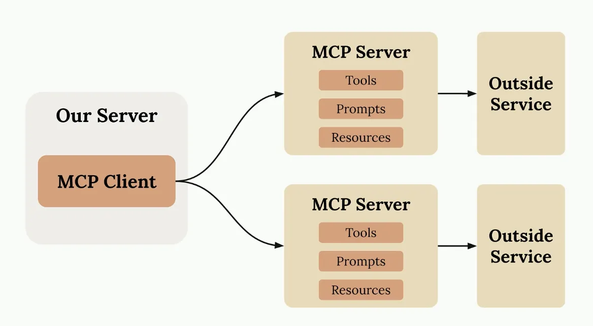
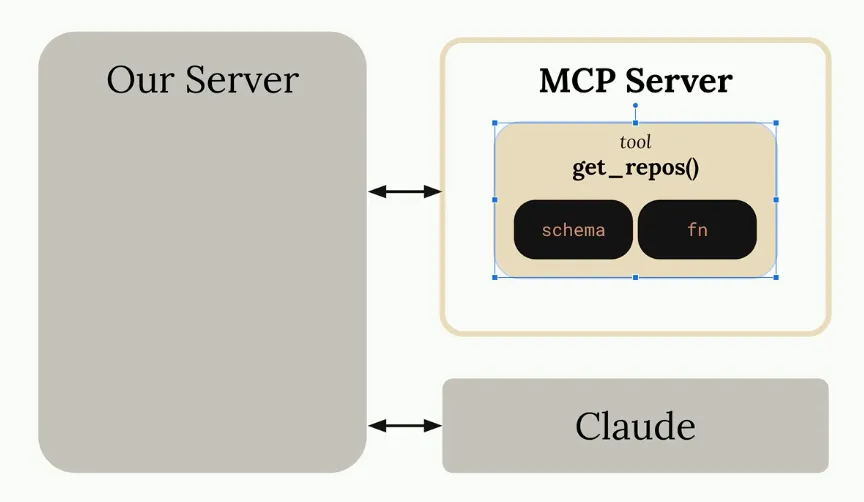
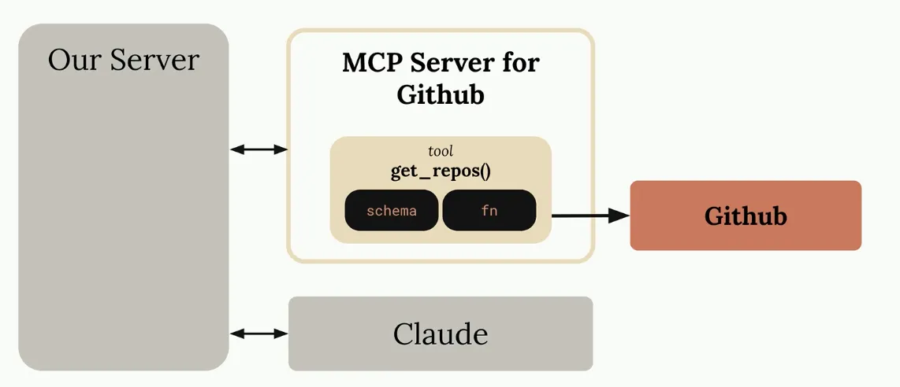

### Introducing MCP

- chat interface using llm with github mcp tools

- tool functions
    - to handle all of github’s functionality. we’d have to create an incredible number of tools schemas and functions
        - this is all code that we (developers) have to write test and maintain
    
    → shifts the burden of tools definition and execution onto MCP servers
    

- Q&A
    - how is different from just calling a service’s api directly?
        - mcp servers provide tool schema + functions
        - if you want to directly call an API directly, you’ll be authoring those on your own
    - sounds like MCP servers and tool use are the same thing
        - MCP servers provide tool schemas + functions already defined for you (kinda bigger concept)