## overview

I've set up a clean architecture for the ai repository and containerized it. this pipeline is deployed on a remote server ready for action.

---

## background

- **requirements**

  we need to develop a speech API that allows users to communicate with golem NPCs. in a Unity-based game, users activate their microphones locally, send the recorded audio to the server, and receive NPC responses in text form.

- **priorities**

  1. first, complete the speech transcript to text-to-text pipeline.
  2. ensure smooth API communication on the remote server.
  3. focus on reducing latency as much as possible.

- **secondary priorities**

  - prompt tuning
  - enhance security with the WSS protocol

## purpose

to build a speech-to-text and text-to-text API that operates reliably on a remote server.

## environment setup

- managing dependencies with uv and pyproject.toml
- server IP address: http://44.210.134.73:8000/docs
- api endpoint: ws://44.210.134.73:8000/api/v1/ws/speech/v1
- we handle dependencies with clean architecture through container implementation and injection.

---

## implementation process

### design

- architecture: DDD + clean architecture


```bash
demo/src/ai
├── datasets # testfile
├── docker-compose.yaml
├── Dockerfile
├── interaction
│   ├── core
│   │   ├── components #llm and speech component
│   │   ├── di
│   │   │   ├── config.py
│   │   │   └── container.py
│   │   ├── domain
│   │   │   └── usecase
│   │   ├── infra
│   │   │   ├── model_configs.py
│   │   │   └── model_router.py #litellm Router
│   │   └── utils
│   ├── server
│   │   ├── app.py
│   │   ├── core
│   │   │   └── session_manager.py #for ws session managing
│   │   ├── dto
│   │   │   └── speech.py
│   │   ├── router
│   │   │   └── speech
│   │   │       └── v1.py
│   │   └── tests # test server files
│   │       └── test_websocket_speech.py
│   ├── speech
│   │   ├── components
│   │   │   ├── speech_to_text
│   │   │   │   └── llm_speech_to_text_v1.py
│   │   │   └── text_to_text
│   │   │       └── llm_text_to_text_v1.py
│   │   ├── di
│   │   │   └── container.py
│   │   ├── domain
│   │   │   ├── ports
│   │   │   │   ├── speech_to_text.py
│   │   │   │   └── text_to_text.py
│   │   │   └── usecases
│   │   │       └── generate_conversation_response.py
│   │   ├── main.py
│   │   ├── prompts
│   │   │   └── text_to_text_v1.py
│   │   └── tests
│   │       ├── test_speech_to_text.py
│   │       └── test.py
│   └── text
├── Makefile
├── pyproject.toml
└── uv.lock
```
  
implementing the domain-driven design approach with a focus on clean architecture principles ensures robust application structure and maintainability.

diagram is as follows:

```mermaid
flowchart LR
    subgraph Client
        Mic[Microphone / Unity Client]
        VAD[VAD & Chunking]
        WS[WebSocket Message]
    end
    
    subgraph Server
        Router[/interaction/server/router/speech/v1.py/]
        SessionMgr[/interaction/server/core/session_manager.py/]
        UseCase[/interaction/speech/domain/usecases/generate_conversation_response.py/]
        STT[/interaction/speech/domain/ports/speech_to_text.py<br/>+ adapters/]
        TTT[/interaction/speech/domain/ports/text_to_text.py<br/>+ adapters/]
    end
    
    Mic --> VAD
    VAD --> WS
    WS --> Router
    Router -->|SESSION_START / AUDIO_CHUNK / SESSION_END| SessionMgr
    SessionMgr -->|"assembled audio (BytesIO)"| UseCase
    UseCase -->|transcribe_user_audio_to_text| STT
    STT -->|transcription text| UseCase
    UseCase -->|create_response_from_user_audio_text| TTT
    TTT -->|LLM response text| UseCase
    UseCase -->|"{'transcription','response'}"| Router
    Router -->|PROCESSING / RESULT / ERROR| WS
    WS --> Client
```



### result

- splitting an audio file `/datasets/test.wav` into chunks and requesting through the API gives expected results. logging indicates successful test completion.

### pr

https://github.com/ob1hnk/Triolingo/pull/1

---

## troubleshooting

- encountered issues with connecting the speech component to the router through litellm, which was resolved by aligning the implementation with existing components for consistency.

```python
class SpeechLLMComponent:
    """
    speech-to-text component using Router
    """
    def __init__(self, router: Router, prompt_path: str = ""):
        """
        Args:
            router: LiteLLM Router instance
            prompt_path: path to prompt file
        """
        self.prompt_path = prompt_path
        self.router = router
        logger.info(f"SpeechLLMComponent initialized with prompt_path: {prompt_path}")
```

- checked the litellm code thoroughly and resolved integration issues.

- ref docs
    - https://docs.litellm.ai/docs/audio_transcription
    - code snippet
        
        https://github.com/BerriAI/litellm/blob/eca226286ac069128bfa8a1a788bc8bf04659aea/litellm/router.py#L2281