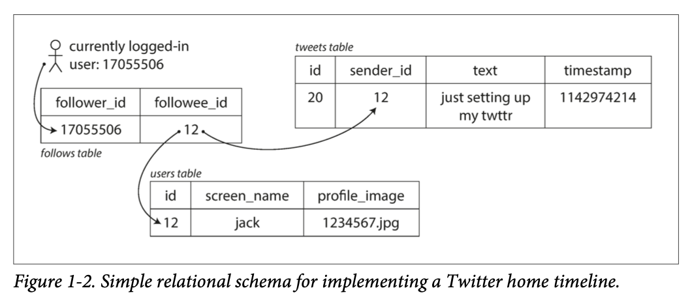



## Introduction

If you're looking for a technical breakdown of the book, you won't find it here. Instead, I've written down my own intuitions and related experiences as I read through the material. Think of it as free association — one idea leading to another, sometimes wandering far from the original text. If you share similar instincts about engineering, you might find this interesting.

Chapter 1 introduces three core concerns: **Reliability**, **Scalability**, and **Maintainability**. It's meant as an entry point into understanding what "data-intensive" really means in practice.

## Reliability

The book distinguishes between *faults* and *failures*. A fault is when a single component deviates from its expected behavior. A failure is when the entire system goes down. Different beasts entirely.

The first thing that came to mind when I read this: I once worked on a service that was heavily dependent on a single external provider. When that provider went down, everything collapsed. Looking back, I realize we never even considered having a fallback. Why? Because the deeper you depend on something, the more invisible it becomes. It starts feeling like bedrock — so fundamental that you stop questioning it. You end up focused on the layers built on top, forgetting that the foundation itself could crack.

### Hardware Faults

The standard solution is redundancy — keeping spare components ready. But this raises some natural questions:

**"Isn't that wasteful if the backup just sits there?"**  
Just turn it off, then.

**"But then there's downtime while it boots up."**  
So keep it in a warm standby state — running but not serving traffic.

**"Doesn't that still waste resources?"**  
Not really. A keep-alive ping every few seconds is negligible.

It comes down to a trade-off: the cost of downtime vs. the cost of maintaining redundancy. In almost every production environment, downtime is far more expensive.

### Software Errors

The book mentions systemic software errors but doesn't go deep. Fair enough — it's a broad topic.

### Human Error

This one hit home. The advice to "test thoroughly at every level" sounds obvious, but it's easy to forget in practice. Monitoring isn't just about setting up dashboards — it's about understanding your system's behavior in real time, from multiple angles.

I remember working with Datadog. I had all these monitors set up, but when errors fired, I was always in firefighting mode. I'd throw the error at ChatGPT, patch it just enough to stop the bleeding, and move on. I never really diagnosed the root cause. At 2 AM, all I wanted was to make the alerts stop so I could sleep. Was there a better way? Probably. But I was too deep in survival mode to see it.

### Why Reliability Matters

Here's something that shifted my perspective: reliability isn't just a technical concern — it's a *promise*.

When you define an SLA, you're telling customers: "This is the performance you can expect." Engineers aren't just workers building features. They're responsible for keeping that promise. I hadn't thought of it that way before. I assumed responsibility lived with management, not the people writing the code.

And yet, I was also surprised to realize how many services don't take this seriously. We've become so accustomed to slow load times and privacy breaches that we've stopped expecting better. The bar has dropped so low that we don't even recognize when services are failing their basic obligations.

Out of curiosity, I checked OpenAI's service agreement. I expected some modest guarantee around response times. Instead, I found this in all caps:

>"12.2. Disclaimer. SUBJECT TO SECTION 12.1, THE SERVICES ARE PROVIDED “AS IS.” TO THE EXTENT PERMITTED BY LAW, EXCEPT AS EXPRESSLY STATED IN THE AGREEMENT, OPENAI AND ITS AFFILIATES AND LICENSORS MAKE NO WARRANTY OF ANY KIND, WHETHER EXPRESS, IMPLIED, STATUTORY OR OTHERWISE, INCLUDING WARRANTIES OF MERCHANTABILITY, FITNESS FOR A PARTICULAR USE, OR NON-INFRINGEMENT. OPENAI MAKES NO REPRESENTATION, WARRANTY OR GUARANTEE THAT SERVICES WILL MEET CUSTOMER’S REQUIREMENTS OR EXPECTATIONS, THAT CUSTOMER CONTENT WILL BE ACCURATE, THAT DEFECTS WILL BE CORRECTED, OR REGARDING ANY THIRD-PARTY SERVICES. OPENAI WILL NOT BE RESPONSIBLE OR LIABLE FOR ANY CUSTOMER CONTENT, THIRD-PARTY SERVICES, THIRD-PARTY CONTENT, OR NON-OPENAI SERVICES (INCLUDING FOR ANY DELAYS, INTERRUPTIONS, TRANSMISSION ERRORS, SECURITY FAILURES, AND OTHER PROBLEMS CAUSED BY THESE ITEMS)."

They explicitly disclaim responsibility for delays. I get it — there are countless variables they can't control. But response time feels like exactly the kind of thing OpenAI should care about most. Pushing that risk entirely onto the customer doesn't sit right with me.

## Scalability

### Framing the Question

Scalability isn't a binary property. You can't just say "our system scales" or "it doesn't." It's more useful to ask: *Given our expected growth trajectory, what parts of the system will break first, and what are our options for addressing them?*

That means you need to start with measurement. What's the current load? How fast is it growing? You can't observe what you haven't defined, so pick your metrics carefully.

### A Twitter Case Study

The book walks through how Twitter evolved its data architecture. 

In version one, every time a user loaded their home timeline, the system queried all relevant tweets in real time. Expensive. Version two flipped the model: when someone posts a tweet, it gets pre-written into the home timeline caches of all their followers. Now reads are cheap.

It's a change in perspective. Version one thought from the reader's point of view. Version two thought from the tweet's point of view. Sometimes the best solutions come from simply looking at the problem from a different angle.

### A Note on Problem-Solving

I used to overcomplicate things. I'd reach for sophisticated methods or complex frameworks, partly out of insecurity — a fear that my own instincts weren't enough. But sometimes the simplest solution is the right one.

Take head-of-line blocking. A slow job holds up everything behind it. The obvious fix? Separate queues for different job types. Fast jobs shouldn't wait behind slow ones.

That's it. No fancy algorithm. And in practice, this is exactly what production systems do — route different workloads to different queues.

Start simple. Hit the wall. Then iterate. If the patches get too tangled, step back and look for a cleaner solution that addresses the accumulated problems at once.

### Metrics Aren't Just Numbers

The book makes an important point: don't think of performance as a single number. Think of it as a *distribution*.

Averages lie. Especially with outliers. You need to look at medians, standard deviations, percentiles — p50, p95, p99. These give you a much richer picture of how your system actually behaves.

### A Quick Note on Terminology

I used to conflate "latency" and "response time." They're related but distinct:

- **Latency** is the time a request spends waiting to be processed.
- **Response time** is the full round trip: latency + processing + network travel.

So when I was benchmarking AI model calls from a Unity client to a server, I was measuring *response time*, not latency.

### Scaling Strategies

There are two approaches:

1. **Vertical scaling** — buy a bigger, faster machine.
2. **Horizontal scaling** — distribute the load across many smaller machines.

I've mostly done the latter, usually because I didn't have access to better hardware. But I remember a senior engineer once telling me: "Why are we duct-taping all these small pieces together? A single powerful machine could solve this problem cleanly."

That stuck with me. Sometimes brute force is the right answer. Other times, a well-designed distributed system can match or exceed the power of a single expensive box.

The book suggests that distributed architectures are becoming the default, even for use cases that don't strictly require them. I agree. It's a pattern worth internalizing.

## Maintainability

In the real world, shipping a feature is never the end. Requirements keep coming. Features keep stacking. I've been guilty of trying to build the "perfect" version upfront, even knowing more changes were inevitable. That's a mistake.

Better to get a feel for where the project is headed. Will it be thrown away in six months? Will it grow in one specific direction? Will it accumulate small requests over time? Having even a rough sense of this helps you build something that ages gracefully.

### Operability

Good operability means making life easier for the people who have to run your system. I've seen engineers toss raw code over the wall to ops teams and call it done. "Not my job."

But it *is* your job. If your work ends up in production, you're responsible for making it operable. Build friendly interfaces. Write clear documentation. Don't make people reverse-engineer your code just to keep it running.

Here's what the book says good operability looks like:

- Visibility into runtime behavior
- Support for automation and standard tooling
- No dependency on individual machines
- Clear operational models ("if I do X, Y happens")
- Sensible defaults with room for override
- Self-healing where appropriate, with manual controls available
- Predictable behavior, minimal surprises

### Managing Complexity

The book argues that abstraction is the best tool for reducing accidental complexity. Programming languages abstract away machine code. Good APIs abstract away implementation details. Complexity doesn't disappear — it gets hidden behind simpler interfaces.

For a long time, I was drawn to complexity. I found intricate systems more interesting than simple ones. But I was missing the point. Simple systems are easier to understand, and easier to change. That matters more than elegance.

Right now, my toolbox is lopsided — full of heavy-duty tools suited for large, safety-critical systems. But for early-stage projects, that's overkill. I need lighter tools too. So I'm studying more architectures, building out a broader inventory. The goal is to match the tool to the situation — and that versatility feels like the real skill.

## 소개
책의 기술적인 내용을 직접 다루기 보다는 내가 직관적으로 이해한 내용과 관련된 경험들을 작성해두었다. 책에 제한 없이 관련된 이야기를 자유 연상하면서 확장해 나가는 스토리텔링 블로그 글이다. 그래서 이 글은 책을 공부하는데는 도움이 되지 않는다. 하지만 나와 비슷한 직관을 가졌다면 읽어보기에 흥미로울 것 같다.  
책은 1장 Reliable, Scalable, and Maintainable Applications에서 주요한 3개의 관심사를 다룬다. 엔지니어링 실무의 실상황부터 시작해 훑어보면서 데이터 중심의 애플리케이션 성격이 무엇인지 이해하려고 하는 인트로였다.

## 본론
### 1. 신뢰성
 결함과 장애가 있다. 결함은 기존에 우리끼리 정의한 사양에서 벗어난 시스템의 한 구성요소이다. 실전상황에서 발생하지 않도록 엔지니어는 고의적으로 결함을 유도해 시스템에 내결합성을 만들어나가고, 그것을 지속적으로 훈련하고 테스트해야 한다.  
장애는 시스템 전체가 멈춘 상태로 결함과 규모/ 맥락이 다르다. 가장 먼저 떠오른 장애는, 서비스에서 한 provider에 크게 의존했는데 그 provider가 break down하면서 전체 시스템 장애가 발생했다. 이런 상황에 대비해 다른 provider에 유연하게 스위칭할 생각을 애초에 생각하지 못했던 이유는, 의존도가 커지다 보면 - 안전해보인다는 착각이 들고 오히려 가장 주요하게 내걸는 피처(feature)이기 때문에 - 거기에 문제가 생길거라는 생각을 못하게 된다. 가장 초석이기 때문에, 걔를 포장하는 주위의 거대한 시스템에 눈을 뺏겨버리는 경우가 있다.

신뢰성에 영향을 미치는 대표적인 요소로는 하드웨어 결함, 소프트웨어 오류, 인적 오류이다.

- 하드웨어 결함

하드웨어 구성요소에 redundancy를 추가하는 해결책이 일반적이다. 예비를 두는것인데. 그럼 떠오르는 질문은 
q. 그럼 사용되지 않고 낭비되는 거 아닌가요? 
a. 그냥 turn off하고 있으면 되잖아 
q. 그럼 다시 부팅하는데 시간이 빌텐데. 서버 다운 시간이 발생할 수 밖에 없는데.  
a. 그럼 반쯤 꺼놓은 상태로 계속 keep alive ping 같은 걸 보내자 
q. 그러면 리소스 낭비 아닌가요? 
=> 결국 다운 타임의 비용 대 redundancy 유지 비용의 트레이드 오프 문제이다. (알아보니 전자가 압도적으로 손실이 크다고 하니 active-passive을 선택하자) 

- 소프트웨어 오류

시스템적인 오류를 의미한다. 저자가 구체적으로 전개하지 않았다.

- 인적 오류(human error)

모든 수준에서 철저하게 테스트하라, 간단한 말이지만 개인적으로 가장 와닿았다. 또한, 모니터링하고 장애를 해석하는 능력을 갖추어야 하는데, 모니터링 대시보드를 여러개 만들고 현재 서비스를 여러 메트릭으로 실시간으로 확인하면서 지금 돌아가고 있는 애를 입체적으로 이해하는 거다. 얘의 사생활을 샅샅히 파헤친다는 일념하에. 
책을 읽으면서 나의 datadog 모니터링 경험이 떠올랐다. 많이 아쉬운 기억인데. 기껏 만들어둔 데이터독 모니터링에서 에러가 발생해도 그때는 매일이 급했기 때문에 지피티로 급하게 에러 원인을 분석하고 쳐내거나, 아니면 성능을 줄이고 오래 시간을 잡아먹으면서 limit만 안넘기려고 애썼던 기억이 있다. 즉, 문제 원인을 제대로 파악하지 못하고 일단 굴러가게만 만드는 게 최선이라고 믿었다. 그 일을 새벽에 하면서 빨리 자고 싶었으니 뭐 어쩔 수 없지만 그럼에도 더 최선은 없었는지는 많이 아쉬운 입장이다

 
 

신뢰성이 중요한 이유는 무엇인가. 고객들에게 해당 성능을 주기로 약속을 했기 때문이다. 즉 책임이다. 책에서 언급된 서비스의 SLO, SLA와 관련되는데, 사실 이번에 처음 알았다. SLA를 통해 고객에게 성능을 약속하고 그것을 지키기 위해 엔지니어가 책임져야 된다는 걸 깨달았다. (엔지니어는 그냥 직장인인줄 알았지 경영진처럼 서비스에 대한 책임을 져야되는 역할로 생각하지 못했던 것 같다.) 응답 시간을 약속하고 그걸 반드시 지속적으로 제공해야 된다는 걸 이번에 책임이란 관점으로 새롭게 보게되었다. 아니 생각보다 엔지니어 책임이 크잖아. 이것에 놀란 또다른 이유가 생각보다 많은 서비스가 지키질 않아서다. 기대치가 너무 낮아졌다. 개인정보가 보호되지 않고 로딩을 오래 기다리는 게 흔해지다 보니 애초에 서비스가 책임져야될 부분이라 인식을 못한 거였다.  
서비스는 광고에서 약속한 것들을 책임져야 한다. 요새는 그게 지켜지지 않는 것 같다.

한번 openai의 service agreement를 확인해보았다. [OpenAIs SLA](https://openai.com/policies/services-agreement/)  
response time에 대해 소심하게 다룰 줄 알았더니 그와 반대 내용이 대문자로 적혀있어서 놀랐다

> "12.2. Disclaimer. SUBJECT TO SECTION 12.1, THE SERVICES ARE PROVIDED “AS IS.” TO THE EXTENT PERMITTED BY LAW, EXCEPT AS EXPRESSLY STATED IN THE AGREEMENT, OPENAI AND ITS AFFILIATES AND LICENSORS MAKE NO WARRANTY OF ANY KIND, WHETHER EXPRESS, IMPLIED, STATUTORY OR OTHERWISE, INCLUDING WARRANTIES OF MERCHANTABILITY, FITNESS FOR A PARTICULAR USE, OR NON-INFRINGEMENT. OPENAI MAKES NO REPRESENTATION, WARRANTY OR GUARANTEE THAT SERVICES WILL MEET CUSTOMER’S REQUIREMENTS OR EXPECTATIONS, THAT CUSTOMER CONTENT WILL BE ACCURATE, THAT DEFECTS WILL BE CORRECTED, OR REGARDING ANY THIRD-PARTY SERVICES. OPENAI WILL NOT BE RESPONSIBLE OR LIABLE FOR ANY CUSTOMER CONTENT, THIRD-PARTY SERVICES, THIRD-PARTY CONTENT, OR NON-OPENAI SERVICES (INCLUDING FOR ANY DELAYS, INTERRUPTIONS, TRANSMISSION ERRORS, SECURITY FAILURES, AND OTHER PROBLEMS CAUSED BY THESE ITEMS)."

딜레이가 있어도 그 어떤 책임을 지지 않는다는 것이다.  
음.. 모르겠다, 제어하기 어려운 변수가 많아서 딜레이를 보장한다는 건 거의 불가능에 가깝다는 것에 이해하지만, 나는 openai가 제공해야될 또는 최소한 가장 중요하게 다루어야 할 문제 중 하나라 생각한다. 근데 그걸 고객에게 책임을 씌우는 방향성이 맞는지 모르겠다.

 

### 3. 확장성

- 부하 증가

확장성은 우리 시스템은 확장성이 있어요~ 없어요~ 처럼 유무로 논할 것이 아니다. 그보다 "앞으로 이런 경영 방향에 따라 우리의 시스템이 이런 부분에서 커질 것 같다~ 그러면 이에 대처하기 위한 우리의 선택은 무엇인가"가 확장성이다. 즉 확장성은 현재 이 구체적인 상황에 따른 질문과 판단이다.

- 파악

우선 부하 증가에 대응하려면 파악부터 해야된다. 현재 시스템의 부하는 어느정도이고 현재 어느정도 증가율을 가지는지. 즉 모니터링인데
모니터링을 위해서는 metric, 부하 매개변수가 필요하다. 일단 정량 단위를 정의해야 관찰할 수 있다.

 

책에서는 트위터가 데이터를 읽어오는 방식을 비교했는데.

 버전 1은 유저가 매 홈 타임라인을 요청하면 모든 트윗을 질의하여 로드하는 형식이었다. 질의 비용이 비싸다 보니 이를 개선하기 위한 - 버전 2는 한 명의 유저가 게시글을 올렸을 때 다른 유저들의 캐시에 미리 써놓는 방식이었다. 그러면 금방 가져올 수 있다. 관점을 바꾼 것인데, 버전 1은 유저 1명의 홈 피드에서 생각하다 보니 글을 가져오는 방식이 버전 1처럼 정의됐고. 관점을 바꿔 아티클 입장에서 접근한 해결책이라 생각한다.

 

또 딴길로 새자면 나는 해결하고자 하는 문제를 너무 방대하게 생각했던 것 같다. 최신의 method라던지 복잡한 이론을 가져온다던지. 그걸 이해를 하고 필요성이 맞아 떨어져서 가져왔다면 적합한데, 자신에게는 답이 없을 거라는 두려움에 외부에서 큰 거를 가져오려했던 것 같다. 일단 한번 천천히 생각해보자. 직관적으로 해결책을 찾는게 가장 쉬울 수도 있다. 예를 들어 HOL(Head of Line) Blocking을 생각해보자. 가장 많이 지체되는 작업 때문에 빠른 후속 처리 작업이 대기하는 현상이다. 직관적으로 생각해보면 대기 큐를 작업 유형에 따라 분산하는 단순한 해결책이 떠오른다. 어느정도 Job이 예상 가능하다면 job 유형 별로 대기 큐를 설계하는 방식이 있다. 그러면 오래걸리지 않는 작업들은 오래 대기할 필요가 없다. 실제로도 실서비스 큐에서는 작업별로 큐를 분기한다. 생각보다 해결책은 단순할 수 있다. 일단 해보고 또 문제점을 맞닥 뜨릴 것이다. 그때 또 해결책에 또 해결책을 붙이거나, 너무 복잡해진다면 지금까지의 해결해야되는 문제를 나열해서 그걸 한꺼번에 해결하는 솔루션을 찾을려고 해보자.
 

- 부하 지표

**"단일 숫자가 아니라 측정 가능한 값의 분포로 생각해야 된다".** 평균은 해당 데이터에 대한 이해를 보장해주지 않는다. 데이터는 복합적이어서 평균의 단일 지표로는 이해하기 어렵다. 특히 이상치가 많은 데이터에서는 평균은 그 정의에 부합하는 역할을 수행하지 못한다. 그래서 여러 지표들로 비교하면서 얘의 매력을 자세히 살펴보는 것이다. 얘의 부분(subset)들을 더 자세히 이해하는 것인데. 그 지표로는 std, median, p50, p95, p99 등이 있다. 

 

> **throughput vs resposne time**  
실제로 회사에서도 혼용해서 사용했던 것 같다(그냥 내가 잘못 이해했을 가능성도 충분히 있다)
책의 설명으로는 부족해서 아래 아티클을 추가적으로 읽었는데    - [https://www.linkedin.com/pulse/latency-vs-response-time-pratima-upadhyay/](https://www.linkedin.com/pulse/latency-vs-response-time-pratima-upadhyay/)  
latency는 response time의 component이다. latency는 사전적 정의에 따라 해석하는게 가장 올바른 것 같다. latent, 휴지 상태의 duration time이다. "Latency is the time duration in which a rquest is waiting to be handled"
response time은 processing time + round trip of latency이다. 
(*processing time, time taken by the server from receiving the last byte of the requet and returning the first byte of the response) 
즉 내가 지금 현재 졸업 프로젝트에서 분석중인 유니티 클라이언트에서 AI 서버에 요청하고 -> 프로세스가 돌고 -> response가 오는 데까지 시간을 측정한 실험은 latency comparsion 실험이 아니라 response time comparison이라 불러야 적절하다. 

 

- 부하 대응 접근 방식

2가지 접근 방식이 있는데 수직적 확장인 용량 확장, 즉 그냥 비싸고 좋은 거 하나 사서 해결하는 방식이다. 2번째는 수평적 확장인 규모 확장이다. 싼 거 여러개 둬서 분산하여 해결하는 방식이다.  
나는 후자로 급하게 해결했던 경험들이 많았던 것 같은데, 왜냐면 똑똑하고 비싼애가 아직 없었기 때문이었다. 이와 관련해서 어떤 엔지니어 분이 한 얘기가 생각난다. "이거 어차피 해봤자 크게 의미없을 것 같다. 이 시스템을 제공해주는 게 곧 출시될 것 같다. 이 작은 것들 이어붙여서 시스템 만들어서 비용 추적하는게 의미가 있을까? 그냥 비싸고 똑똑한 애 한명까지고 해결하면 될 문제 같은데"
당시의 내게 인상적인 인사이트였다 (맨날 싼것들로 후드려 패 해결하려고만 해서...)  
해결해야되는 문제를 뚜렷히 그리고 전략을 잘 취하면 될 것 같다. 똑똑한 애 하나 써먹는게 나을 수도 있고, 아니면 작은 애들 여러개 둬서 잘 분산 시키면 똑똑한 애만큼 강력할 수 있다. 저자는 책에서 대용량 데이터와 트래픽(=분산이 critical한 케이스들)을 다루지 않는 사용 사례에도 분산 데이터 시스템이 **기본** 아키텍처로 자리 잡을 가능성이 있다고 얘기하고 크게 동의한다. 엔지니어가 꼭 익혀야 될 중요한 패턴 중 하나이다. (공부해야된다)

 

### 3. 유지 보수성

현실 업무에서는 하나 프로덕트 완성했다고 끝이 아니라 계속 기능 추가와 요구사항이 붙는다. 나는 마음이 급하다보니 계속 초기에 가장 완벽할 수 있는 프로덕트를 만드는데 집중했다. 이후에 계속 요구사항이 붙을 걸 알면서 이렇게 개발하는 건 정말 멍청이다. (나는 멍청이었다) 흐름을 느끼면서 내가 만드는 이 대상이 이 회사에 어떤 성격을 가질 것인지 유추를 해보자. 금방 버려질 것 같을지, 특정 방면으로 뚱뚱해질 가능성이 있다라던지, 반복적으로 매일 사용하면서 자잘한 요구사항이 계속 붙을 것인지. 어느정도 감을 가진채 처음에 만들기 시작하면 완성된 이후 시간이 지나면서 더 근사한 애가 될 수도 있다.

- 좋은 운영성

을 제공하는 게 엔지니어의 역할이다. 운영팀은 엔지니어가 만든 결과물을 계속 만져야되는 데, 엔지니어가 로우레벨의 코드 결과물을 그냥 운영팀에 던지는 경우를 봐왔다. 본인의 역할이 아니라는 생각이 때문인 것 같다. 근데 거기까지도 엔지니어의 책임인 것이다. 나의 개발물이 운영에 필요하게 되었다면 그들이 사용하기 편하도록 친절한 인터페이스를 만드는 몫도 엔지니어이다.  
친절한 엔지니어 이미지를 지향해야 된다 생각한다. 그리고 귀찮아서 있는 그대로 굴러가게 하는 시간보다, 오히려 (다른 사람들이 잘 사용할 수 있도록) 추가 개발하는데 드는 시간이 훨씬 더 적을 수 있다. 실제로 경험했다.

 

저자가 제시한 좋은 운영성에 대한 설명이다. 명심해야겠다.  
_"좋은 운영성이란 동일하게 반복되는 테스크를 쉽게 수행하게끔 만들어 운영팀이 고부가가치 활동에 노력을 집중한다는 의미다"_   

• Providing visibility into the runtime behavior and internals of the system, with good monitoring  
• Providing good support for automation and integration with standard tools  
• Avoiding dependency on individual machines (allowing machines to be taken down for maintenance while the system as a whole continues running uninterrupted)  
• Providing good documentation and an easy-to-understand operational model (“If I do X, Y will happen”)  
• Providing good default behavior, but also giving administrators the freedom to override defaults when needed  
• Self-healing where appropriate, but also giving administrators manual control over the system state when needed  
• Exhibiting predictable behavior, minimizing surprises

  

- 복잡도 관리

우발적 복잡도를 제거하기 위한 최상의 도구는 추상화라 언급된다. 예시로, 파이썬과 같은 프로그래밍 언어는 기계언어를 추상화한 예시인데 백단에서는 기계언어를 사용하지만 유저가 직접 사용하지 않도록. 복잡한 세계를 더 단순하고 직관적인 세계로 재해석해서 보여주는 것과 같다. 책에서 **간단하고 이해하기 쉬운 시스템은 대개 복잡한 시스템보다 수정하기 쉽다**라 언급되는데, 맞는 말이다.   
계속 복잡하고 화려해보이는 거에만 집착했었다. 어려운 것에 재미를 느껴서 그런거였지만, 단순한것이 만들어내는 임팩트를 볼 수 있는 눈이 없었던 것이다. 지금 나의 인벤토리에는 복잡하고 화려한 도구 하나만 있다. 규모있고 안전성이 중요한 상황에서는 적합하지만, 초기 시작할때는 거추장스럽고 너무 거품이 많다. 초기에는 알맹이 하나만 딱 필요하다. 그러기 위해 다른 아키텍처들도 공부해서 인벤토리에 도구들을 많이 추가하려고한다. 그때그때 상황에 따라 맞는 도구들 꺼내면 정말 근사할 것 같다.

