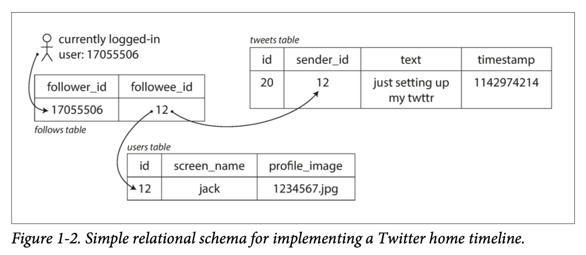

## Introduction

If you're looking for a technical breakdown of the book you won't find it here. Instead I've written down my own intuitions and related experiences as I read through the material. Think of it as free association — one idea leading to another sometimes wandering far from the original text. If you share similar instincts about engineering you might find this interesting.

Chapter 1 introduces three core concerns: **Reliability** **Scalability** and **Maintainability**. It's meant as an entry point into understanding what "data-intensive" really means in practice.

## Reliability

The book distinguishes between _faults_ and _failures_. A fault is when a single component deviates from its expected behavior. A failure is when the entire system goes down. Different beasts entirely.

The first thing that came to mind when I read this: I once worked on a service that was heavily dependent on a single external provider. When that provider went down everything collapsed. Looking back I realize we never even considered having a fallback. Why? Because the deeper you depend on something the more invisible it becomes. It starts feeling like bedrock — so fundamental that you stop questioning it. You end up focused on the layers built on top forgetting that the foundation itself could crack.

### Hardware Faults

The standard solution is redundancy — keeping spare components ready. But this raises some natural questions:

**"Isn't that wasteful if the backup just sits there?"**
Just turn it off then.

**"But then there's downtime while it boots up."**
So keep it in a warm standby state — running but not serving traffic.

**"Doesn't that still waste resources?"**
Not really. A keep-alive ping every few seconds is negligible.

It comes down to a trade-off: the cost of downtime vs. the cost of maintaining redundancy. In almost every production environment downtime is far more expensive.

### Software Errors

The book mentions systemic software errors but doesn't go deep. Fair enough — it's a broad topic.

### Human Error

This one hit home. The advice to "test thoroughly at every level" sounds obvious but it's easy to forget in practice. Monitoring isn't just about setting up dashboards — it's about understanding your system's behavior in real time from multiple angles.

I remember working with Datadog. I had all these monitors set up but when errors fired I was always in firefighting mode. I'd throw the error at ChatGPT patch it just enough to stop the bleeding and move on. I never really diagnosed the root cause. At 2 AM all I wanted was to make the alerts stop so I could sleep. Was there a better way? Probably. But I was too deep in survival mode to see it.

### Why Reliability Matters

Here's something that shifted my perspective: reliability isn't just a technical concern — it's a _promise_.

When you define an SLA you're telling customers: "This is the performance you can expect." Engineers aren't just workers building features. They're responsible for keeping that promise. I hadn't thought of it that way before. I assumed responsibility lived with management not the people writing the code.

And yet I was also surprised to realize how many services don't take this seriously. We've become so accustomed to slow load times and privacy breaches that we've stopped expecting better. The bar has dropped so low that we don't even recognize when services are failing their basic obligations.

Out of curiosity I checked OpenAI's service agreement. I expected some modest guarantee around response times. Instead I found this in all caps:

> "12.2. Disclaimer. SUBJECT TO SECTION 12.1 THE SERVICES ARE PROVIDED "AS IS." TO THE EXTENT PERMITTED BY LAW EXCEPT AS EXPRESSLY STATED IN THE AGREEMENT OPENAI AND ITS AFFILIATES AND LICENSORS MAKE NO WARRANTY OF ANY KIND WHETHER EXPRESS IMPLIED STATUTORY OR OTHERWISE INCLUDING WARRANTIES OF MERCHANTABILITY FITNESS FOR A PARTICULAR USE OR NON-INFRINGEMENT. OPENAI MAKES NO REPRESENTATION WARRANTY OR GUARANTEE THAT SERVICES WILL MEET CUSTOMER'S REQUIREMENTS OR EXPECTATIONS THAT CUSTOMER CONTENT WILL BE ACCURATE THAT DEFECTS WILL BE CORRECTED OR REGARDING ANY THIRD-PARTY SERVICES. OPENAI WILL NOT BE RESPONSIBLE OR LIABLE FOR ANY CUSTOMER CONTENT THIRD-PARTY SERVICES THIRD-PARTY CONTENT OR NON-OPENAI SERVICES (INCLUDING FOR ANY DELAYS INTERRUPTIONS TRANSMISSION ERRORS SECURITY FAILURES AND OTHER PROBLEMS CAUSED BY THESE ITEMS)."

They explicitly disclaim responsibility for delays. I get it — there are countless variables they can't control. But response time feels like exactly the kind of thing OpenAI should care about most. Pushing that risk entirely onto the customer doesn't sit right with me.

## Scalability

### Framing the Question

Scalability isn't a binary property. You can't just say "our system scales" or "it doesn't." It's more useful to ask: _Given our expected growth trajectory what parts of the system will break first and what are our options for addressing them?_

That means you need to start with measurement. What's the current load? How fast is it growing? You can't observe what you haven't defined so pick your metrics carefully.

### A Twitter Case Study

The book walks through how Twitter evolved its data architecture.

In version one every time a user loaded their home timeline the system queried all relevant tweets in real time. Expensive. Version two flipped the model: when someone posts a tweet it gets pre-written into the home timeline caches of all their followers. Now reads are cheap.

It's a change in perspective. Version one thought from the reader's point of view. Version two thought from the tweet's point of view. Sometimes the best solutions come from simply looking at the problem from a different angle.

### A Note on Problem-Solving

I used to overcomplicate things. I'd reach for sophisticated methods or complex frameworks partly out of insecurity — a fear that my own instincts weren't enough. But sometimes the simplest solution is the right one.

Take head-of-line blocking. A slow job holds up everything behind it. The obvious fix? Separate queues for different job types. Fast jobs shouldn't wait behind slow ones.

That's it. No fancy algorithm. And in practice this is exactly what production systems do — route different workloads to different queues.

Start simple. Hit the wall. Then iterate. If the patches get too tangled step back and look for a cleaner solution that addresses the accumulated problems at once.

### Metrics Aren't Just Numbers

The book makes an important point: don't think of performance as a single number. Think of it as a _distribution_.

Averages lie. Especially with outliers. You need to look at medians standard deviations percentiles — p50 p95 p99. These give you a much richer picture of how your system actually behaves.

### A Quick Note on Terminology

I used to conflate "latency" and "response time." They're related but distinct:

- **Latency** is the time a request spends waiting to be processed.
- **Response time** is the full round trip: latency + processing + network travel.

So when I was benchmarking AI model calls from a Unity client to a server I was measuring _response time_ not latency.

### Scaling Strategies

There are two approaches:

1. **Vertical scaling** — buy a bigger faster machine.
2. **Horizontal scaling** — distribute the load across many smaller machines.

I've mostly done the latter usually because I didn't have access to better hardware. But I remember a senior engineer once telling me: "Why are we duct-taping all these small pieces together? A single powerful machine could solve this problem cleanly."

That stuck with me. Sometimes brute force is the right answer. Other times a well-designed distributed system can match or exceed the power of a single expensive box.

The book suggests that distributed architectures are becoming the default even for use cases that don't strictly require them. I agree. It's a pattern worth internalizing.

## Maintainability

In the real world shipping a feature is never the end. Requirements keep coming. Features keep stacking. I've been guilty of trying to build the "perfect" version upfront even knowing more changes were inevitable. That's a mistake.

Better to get a feel for where the project is headed. Will it be thrown away in six months? Will it grow in one specific direction? Will it accumulate small requests over time? Having even a rough sense of this helps you build something that ages gracefully.

### Operability

Good operability means making life easier for the people who have to run your system. I've seen engineers toss raw code over the wall to ops teams and call it done. "Not my job."

But it _is_ your job. If your work ends up in production you're responsible for making it operable. Build friendly interfaces. Write clear documentation. Don't make people reverse-engineer your code just to keep it running.

Here's what the book says good operability looks like:

- Visibility into runtime behavior
- Support for automation and standard tooling
- No dependency on individual machines
- Clear operational models ("if I do X Y happens")
- Sensible defaults with room for override
- Self-healing where appropriate with manual controls available
- Predictable behavior minimal surprises

### Managing Complexity

The book argues that abstraction is the best tool for reducing accidental complexity. Programming languages abstract away machine code. Good APIs abstract away implementation details. Complexity doesn't disappear — it gets hidden behind simpler interfaces.

For a long time I was drawn to complexity. I found intricate systems more interesting than simple ones. But I was missing the point. Simple systems are easier to understand and easier to change. That matters more than elegance.

Right now my toolbox is lopsided — full of heavy-duty tools suited for large safety-critical systems. But for early-stage projects that's overkill. I need lighter tools too. So I'm studying more architectures building out a broader inventory. The goal is to match the tool to the situation — and that versatility feels like the real skill.
