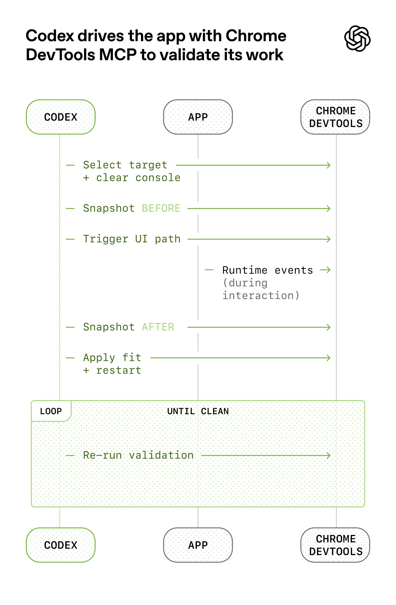

> Harness engineering is a popular term in developers, investigated and write about a tech blog about it. Read OpenAI codex documents and youtube videos about it

### openai documents 
experiment: shipping sw product with 0 lines of manually written code 

human steer -> agents execute, team of agents
- initial AGENTS.md file that directs agent how to work in the repository was itself written by Codex.
- philosphy : no manually written code
- redefining the role of the engineer: 
    - journey: 
        (1) working depth-first: breaking larger goals into smaller building blocks
        when something broke, engineers intervene and ask questions to agents to improve the learning framework rather than making it solve the current broken task
        (2) only interacted with prompts
- problem: human QA capacity couldn't follow the code throughput -> so made agents to review it
    - git worktree -> codex used it
    - connected with Chrome DevTools
    
> We regularly see single Codex runs work on a single task for upwards of six hours (often while the humans are sleeping). Wow

- Context management: **give Codex a map, not a 1000 page instruction manual
    one big AGENTS.md apporach failed
    => instead of treating AGENTS.md as the encyclopedia, we treat it as the table of contents (short 100 lines injected into context and serves primarily as a map) = Architecture documentation
    => progressive disclosure: agents start with small, stable entry point and are taught where to look next, rather than being overwhelmed up front
    => "doc-gardening" agent

> idea: build an opensource agent that builds context graph, and can implement easily

- Legibility
put external context all to the repo (like slack messages, internal documents etc..)

- Enforcing taste
    1. Layer constraints: Enforce a strict layered architecture by restricting dependency directions between modules. (Use linter to inforce the physics term)
    2. Dependency validation: Use custom linters and structural tests to automatically detect and block invalid dependencies.
    3. Taste invariants: Statically enforce coding standards (e.g., logging, naming, file size) to maintain consistency across the codebase.

Agents are most effective in environments with strict boundaries and predictable structure. At the same time, explicit about where constraints matter and where they do not -> just set boundaries, and within those boudaries, agetns as freedom in how solution is expressed

- Full agent autonomy also introduces novel problems

    _Our team used to spend every Firday cleaning up AI slop, but that didn' scale_ 
    -> encode golden principles and built recurring cleanup process (regulary code scan, find vilated rules, make pr)

- [https://matklad.github.io/2021/02/06/ARCHITECTURE.md.html](https://matklad.github.io/2021/02/06/ARCHITECTURE.md.html)
    
    written in 2021! _it takes 2x more time to write a patch if you are unfamiliar with the project, but it takes 10x more time to figure out where you should change the code_
    document the codebase, pecify a more-or-less detailed codemap

### [https://www.youtube.com/watch?v=rmvDxxNubIg](https://www.youtube.com/watch?v=rmvDxxNubIg)
Context engineering is getting more quality from models, AI works well in brownfield codebases
start conversation -> restart context

> what if we start putting ads in tokens..?

Too many MCP -> easily go to the dumbzone

Use subagents to fetch the context for each role

build context window small
1. RESEARCH: Don't code yet. Let the agent scan files to establish ground truth (docs lie, code doesn't).
2. PLAN: The most critical step. Agent writes a detailed step-by-step plan ("Compression of Intent"). You must review and approve the PLAN, not just the code. This prevents "outsourcing thinking."
3. IMPLEMENT: Execute the approved plan, ideally in a fresh context window.

Key Concept: "Intentional Compaction." Don't let the chat get too long. Frequently ask the agent to summarize the state, then start a NEW chat with that summary to keep the model smart.

Warning: Without this discipline, Juniors use AI to fill skill gaps (shipping slop), and Seniors burn out cleaning it up. Treat context like a scarce resource.

### [Harness Engineering: How to Build Software When Humans Steer, Agents Execute — Ryan Lopopolo, OpenAI](https://www.youtube.com/watch?v=am_oeAoUhew)

> _Comment: Code is still not free, it is still a technical debt and responsibility._ Agreed But would change in 6-7 months

