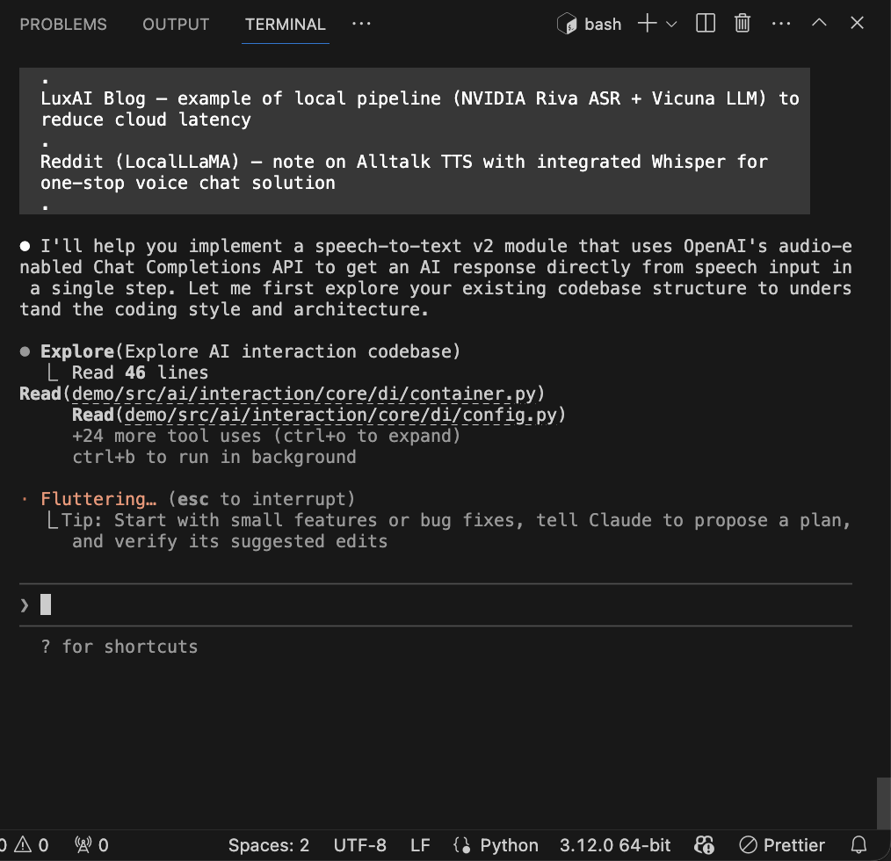
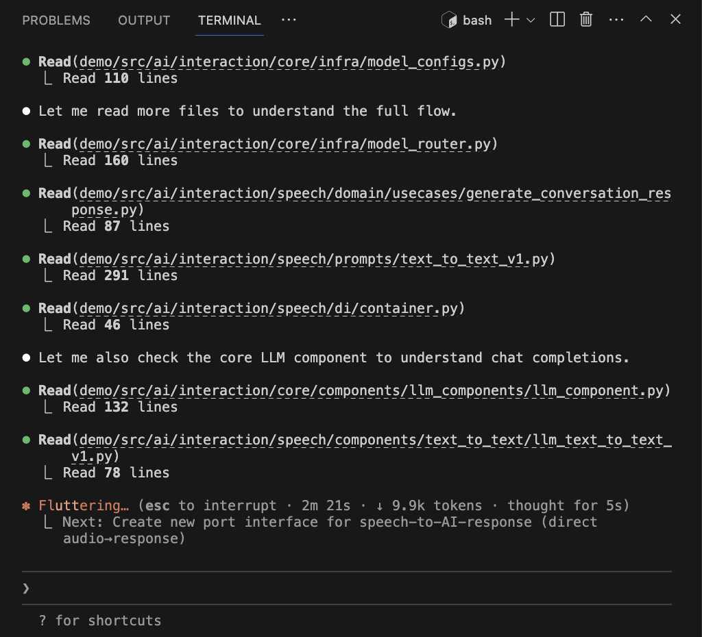

starting claude code

- bash install


- setting up

```
╭─── Claude Code v2.1.2 ────────────────────────────────────────────────╮
│                                                    │ Tips for getting │
│                 Welcome back 세은!                 │  started         │
│                                                    │ Run /init to cr… │
│                       ▐▛███▜▌                      │ ──────────────── │
│                      ▝▜█████▛▘                     │ Recent activity  │
│                        ▘▘ ▝▝                       │ No recent activ… │
│                                                    │                  │
│     Opus 4.5 · Claude Pro ·                        │                  │
│     yellowsubmarine372@gmail.com's Organization    │                  │
│               ~/Documents/graduation               │                  │
╰───────────────────────────────────────────────────────────────────────╯

❯ /terminal-setup 
  ⎿  Installed VSCode terminal Shift+Enter key binding
     See /Users/lenovo/Library/Application Support/Code/User/keybindings.json

❯ /context 
  ⎿   Context Usage
     ⛀ ⛁ ⛁ ⛀ ⛶   claude-opus-4-5-20251101 · 18k/200k tokens (9%)
     ⛶ ⛶ ⛶ ⛶ ⛶   ⛁ System prompt: 2.9k tokens (1.5%)
     ⛶ ⛶ ⛶ ⛶ ⛶   ⛁ System tools: 15.0k tokens (7.5%)
     ⛶ ⛶ ⛶ ⛶ ⛝   ⛁ Messages: 166 tokens (0.1%)
     ⛝ ⛝ ⛝ ⛝ ⛝   ⛶ Free space: 137k (68.5%)
                 ⛝ Autocompact buffer: 45.0k tokens (22.5%)

```

- korean issue (fixed)


짐코딩
지식공유자
2026. 01. 06. 18:34

안녕하세요!

제가 질문을 이해했는지 정확히는 모르지만. 한글 입력 이슈라면

관련해서 클로드 코드 체인지로그 2.0.68 버전에서 관련 문제가 수정되었어요:

-> 참고링크: https://github.com/anthropics/claude-code/blob/main/CHANGELOG.md#2068

"Fixed IME (Input Method Editor) support for languages like Chinese, Japanese, and Korean by correctly positioning the composition window at the cursor"

현재 사용 중인 클로드 코드 버전을 확인해보시고, 최신 버전이 아니라면 업데이트해보세요!

claude --version
claude update
감사합니다 🙏


- first try






⏺ All done! Here's a summary of what was implemented:

  Summary

  New Files Created:

  1. speech/domain/ports/speech_to_speech.py - Port interface for speech-to-speech functionality
  2. speech/components/speech_to_speech/__init__.py - Package init
  3. speech/components/speech_to_speech/llm_speech_to_speech_v1.py - Implementation using OpenAI's gpt-4o-audio-preview model
  4. speech/domain/usecases/generate_conversation_response_v2.py - V2 usecase that uses single API call
  5. speech/domain/ports/__init__.py - Package init for ports

  Modified Files:

  1. core/infra/model_configs.py - Added gpt-4o-audio-preview model config
  2. speech/di/container.py - Added DI wiring for v2 components

  Removed Files:

  1. speech/components/speech_to_text/llm_speech_to_text_v2.py - Cleaned up unused file

  Architecture:

  Audio Input → LLMSpeechToSpeechV1 → gpt-4o-audio-preview API → AI Response Text
                      ↓
             (single API call with audio in messages)

  Usage:

  # Get v2 usecase from DI container
  usecase = speech_container.generate_conversation_response_usecase_v2()

  # Execute with audio
  result = await usecase.execute(audio_file=audio_bytes, language="ko")
  print(result["response"])  # AI response text

✻ Baked for 2m 20s


- short limit 

════════════════ Conversation compacted · ctrl+o for history ═══════════════

❯ This session is being continued from a previous conversation that ran 
  out of context. The conversation is summarized below:                 
  Analysis:                                                             
  Let me chronologically analyze the conversation:                      
                                                                        
  1. **Initial Request**: User wants to add LLM speech-to-text v2 for   
  their game. Previously had 2-step pipeline (audio transcribe →        
  text-to-text) but it's too slow. They want a single API call that     
  takes speech input and outputs AI response text directly using        
  OpenAI's audio-enabled Chat Completions API.                          
                                                                        
  2. **User provided extensive research** about:                        
  - OpenAI's GPT-4 with Audio (Chat Completions API)                    
  - OpenAI Realtime API                                                 
  - Google's Gemini API                                                 
  - Open-source models (Qwen, Voxtral, SpeechGPT)                       
                                                                        
  3. **Explored codebase structure**:                                   
  - Clean architecture with ports/adapters                              
  - Existing v1: `SpeechToTextPort` → `TextToTextPort`                  
  - LiteLLM Router for model management                                 
  - DI container pattern with dependency-injector                       
                                                                        
  4. **User corrections during implementation**:                        
  - Renamed from `speech_to_ai_response` to `speech_to_speech`          
  - Created folder `speech_to_speech` instead of `speech_to_text_v2`    
  - Named component `llm_speech_to_speech_v1.py`                        
                                                                        
  5. **Implementation completed**:                                      
  - Created port interface `speech_to_speech.py`                        
  - Created component `llm_speech_to_speech_v1.py`                      
  - Created usecase `generate_conversation_response_v2.py`              
  - Updated model configs for `gpt-4o-audio-preview`                    
  - Updated DI container                                                
  - Created v2 router                                                   
                                                                        
  6. **Server startup issue**: User couldn't run uvicorn - needed `uv   
  run` prefix. Updated Makefile with `run` target.                      
                                                                        
  7. **Unity endpoint update**: Changed from v1 to v2 endpoint,         
  verified audio format alignment.                                      
                                                                        
  8. **User wanted debug transcription**: To check what model hears     
  from pronunciation. Added `DEBUG_TRANSCRIPTION` env var support.      
                                                                        
  9. **Tracing setup**: User wanted to compare v1 vs v2 latency using   
  Grafana from another branch. Merged tracing code:                     
  - Added `tracing.py` and `trace_context.py`                           
  - Added OpenTelemetry dependencies                                    
  - Added tracing to v2 usecase                                         
  - Added Grafana/Tempo config files                                    
  - Updated docker-compose.yaml                                         
                                                                        
  10. **Production concerns**: User worried about pushing Tempo/Grafana 
  to AWS EC2.                                                           
                                                                        
  11. **Log interpretation**: Debug transcription failing (Whisper      
  returns empty) but v2 working fine.                                   
                                                                        
  12. **Current issue**: User tried v1 in Grafana, can't find traces.   
  Also showing WebSocket disconnect errors.                             
                                                                        
  Summary:                                                              
  1. Primary Request and Intent:                                        
  - Add LLM speech-to-text v2 for a game to reduce latency              
  - Replace 2-step pipeline (Whisper transcription → GPT response)      
  with single-step (audio → AI response directly)                       
  - Use OpenAI's `gpt-4o-audio-preview` model via Chat Completions      
  API                                                                   
  - Implement in clean architecture style matching existing codebase    
  - Add tracing/Grafana to compare v1 vs v2 latency                     
  - Add debug transcription feature to see what model hears             
  (pronunciation debugging)                                             
                                                                        
  2. Key Technical Concepts:                                            
  - OpenAI `gpt-4o-audio-preview` model for audio input in Chat         
  Completions                                                           
  - Audio encoded as base64 in message content with `input_audio`       
  type                                                                  
  - `modalities=["text"]` to get text-only output                       
  - Clean architecture: Ports (interfaces), Adapters                    
  (implementations), UseCases                                           
  - LiteLLM Router for multi-model management with fallbacks            
  - Dependency Injection with `dependency-injector` library             
  - OpenTelemetry for distributed tracing                               
  - Grafana + Tempo for trace visualization                             
  - `uv` package manager (not pip/venv)                                 
                                                                        
  3. Files and Code Sections:                                           
                                                                        
  - **`speech/domain/ports/speech_to_speech.py`** (NEW)                 
  - Port interface for speech-to-speech functionality                   
  ```python                                                             
  class SpeechToSpeechPort(ABC):                                        
  @abstractmethod                                                       
  async def generate_response_from_audio(                               
  self, audio_file: BinaryIO, language: str = "ko",                     
  system_prompt: Optional[str] = None,                                  
  ) -> str:                                                             
  ```                                                                   
                                                                        
  -                                                                     
  **`speech/components/speech_to_speech/llm_speech_to_speech_v1.py`**   
  (NEW)                                                                 
  - Implementation using gpt-4o-audio-preview                           
  - Key methods: `_prepare_audio_bytes()`,                              
  `_detect_audio_format()`, `_build_audio_message()`                    
  - Sends audio as base64 with `modalities=["text"]`                    
                                                                        
  -                                                                     
  **`speech/domain/usecases/generate_conversation_response_v2.py`**     
  (NEW)                                                                 
  - V2 usecase with tracing support                                     
  - Optional debug transcription via Whisper when                       
  `DEBUG_TRANSCRIPTION=true`                                            
  - Uses OpenTelemetry spans for performance tracking                   
                                                                        
  - **`core/infra/model_configs.py`** (MODIFIED)                        
  - Added `gpt-4o-audio-preview` to `OPENAI_MODELS` list                
  - Added model config with fallback to `gpt-4o`                        
                                                                        
  - **`server/router/speech/v2.py`** (NEW)                              
  - WebSocket handler for v2 endpoint at `/api/v2/ws/speech/v2`         
  - Logs debug_transcription if available                               
                                                                        
  - **`speech/di/container.py`** (MODIFIED)                             
  - Added `speech_to_speech` provider                                   
  - Added `generate_conversation_response_usecase_v2` with both         
  speech_to_speech and speech_to_text (for debug)                       
                                                                        
  - **`server/app.py`** (MODIFIED)                                      
  - Added v2 router import and registration                             
  - Added tracing initialization when                                   
  `OTEL_EXPORTER_OTLP_ENDPOINT` is set                                  
                                                                        
  - **`core/utils/tracing.py`** (NEW)                                   
  - OpenTelemetry setup with Tempo exporter                             
                                                                        
  - **`core/utils/trace_context.py`** (NEW)                             
  - ContextVar for trace_id propagation                                 
                                                                        
  - **`docker-compose.yaml`** (MODIFIED)                                
  - Added Tempo and Grafana services for tracing                        
  - Added OTEL environment variables                                    
                                                                        
  - **`Makefile`** (MODIFIED)                                           
  - Added `run`, `run-debug`, `up`, `down`, `logs`, `sync` targets      
                                                                        
  - **Unity `SpeechWebSocketClient.cs`** (MODIFIED by user)             
  - Currently set to v1 endpoint:                                       
  `ws://localhost:8000/api/v1/ws/speech/v1`                             
                                                                        
  4. Errors and fixes:                                                  
  - **uvicorn not found**: User needed `uv run uvicorn` instead of      
  `uvicorn`. Fixed by updating Makefile.                                
  - **File write rejected**: User wanted `speech_to_speech` naming      
  instead of `speech_to_ai_response`. Corrected naming.                 
  - **Debug transcription returns empty**: Whisper API succeeds but     
  returns empty text. This is expected for short/quiet audio - not a    
  code bug.                                                             
  - **LiteLLM token counting error**: Warning about `Invalid content    
  type: <class 'dict'>` - this is expected for audio content, not a     
  real error.                                                           
                                                                        
  5. Problem Solving:                                                   
  - Implemented single-step speech-to-response to reduce latency        
  - Added debug transcription feature to help debug pronunciation       
  issues                                                                
  - Merged tracing infrastructure from separate branch                  
  - Created production-ready docker-compose (attempted but user         
  interrupted)                                                          
                                                                        
  6. All user messages:                                                 
  - Initial request about adding LLM speech-to-text v2 with             
  extensive research                                                    
  - "name it speech_to_speech... don't name it as speech to ai          
  response"                                                             
  - "make a folder speech_to_speech in components and add               
  llm_speech_to_speech v1"                                              
  - "how to start in localhost:8000"                                    
  - "add api endpoint for that usecase"                                 
  - "edit unity endpoint to use that... double check if the audio       
  input is correct"                                                     
  - "can you solve it" (uvicorn not found)                              
  - Request to interpret debug mode logs and pronunciation issues       
  - "i want to compare it with v1... there is grafana... can you        
  operate it for me?"                                                   
  - "i need to push it into aws ec2 server... worried about             
  tempo/grafana dependencies"                                           
  - "can you interpret log?" (debug transcription failing)              
  - "how to compare it in grafana?? give me a very detailed guide"      
  - "ive tried it in v1... span = stt and i can't find it in grafana    
  dashboard"                                                            
                                                                        
  7. Pending Tasks:                                                     
  - Create production docker-compose without Tempo/Grafana              
  (interrupted)                                                         
  - Fix tracing not appearing in Grafana for v1                         
  - Investigate WebSocket disconnect errors in v1                       
                                                                        
  8. Current Work:                                                      
  User is trying to use Grafana to compare v1 vs v2 latency but         
  traces are not appearing. They switched Unity back to v1 endpoint     
  (`/api/v1/ws/speech/v1`) and searched for `span = stt` but couldn't   
  find it in Grafana. The terminal log shows:                           
  - v1 successfully completed: "Conversation response generation        
  completed successfully"                                               
  - But WebSocket errors: "Cannot call 'send' once a close message      
  has been sent"                                                        
  - This indicates Unity client disconnected before server could        
  send the response back                                                
                                                                        
  The tracing issue is likely because:                                  
  1. v1 usecase (`generate_conversation_response.py`) was updated in    
  the tracing branch but not merged to current branch                   
  2. The current v1 doesn't have tracing spans added                    
                                                                        
  9. Optional Next Step:                                                
  Need to add tracing to v1 usecase                                     
  (`generate_conversation_response.py`) so traces appear in Grafana.    
  The user explicitly asked: "ive tried it in v1 (not v2), and span =   
  stt and i can't find it in grafana dashboard. i think it's not logged 
  in grafana. can you check it out?"                                    
                                                                        
  Also need to investigate the WebSocket disconnect error - Unity is    
  closing connection before receiving the response..                    
                                                                        
  If you need specific details from before compaction (like exact code  
  snippets, error messages, or content you generated), read the full    
  transcript at: /Users/lenovo/.claude/projects/-Users-lenovo-Documents 
  -graduation/6bd71104-a9b9-41f9-a65f-2a13a7e70c0c.jsonl                
  Please continue the conversation from where we left it off without    
  asking the user any further questions. Continue with the last task    
  that you were asked to work on.                                       
  ⎿ Referenced file src/unity/GoGoGolemDemo/Assets/Scripts/VADDemoScripts/Sp
    eechWebSocketClient.cs
  ⎿  Read src/ai/Makefile (35 lines)
  ⎿  Read src/ai/interaction/server/app.py (102 lines)
  ⎿  Read src/ai/docker-compose.yaml (63 lines)
  ⎿  Read src/ai/grafana-provisioning/datasources/tempo.yaml (23 lines)
  ⎿  You've hit your limit · resets 5pm 
     (Asia/Seoul)                              02:14 PM  <synthetic>
     Opening your options…


════════════════ Conversation compacted · ctrl+o for history ═══════════════
  ⎿ Referenced file src/unity/GoGoGolemDemo/Assets/Scripts/VADDemoScripts/Sp
    eechWebSocketClient.cs
  ⎿  Read src/ai/Makefile (35 lines)
  ⎿  Read src/ai/interaction/server/app.py (102 lines)
  ⎿  Read src/ai/docker-compose.yaml (63 lines)
  ⎿  Read src/ai/grafana-provisioning/datasources/tempo.yaml (23 lines)
  ⎿  You've hit your limit · resets 5pm (Asia/Seoul)
     Opening your options…

✻ Baked for 58s